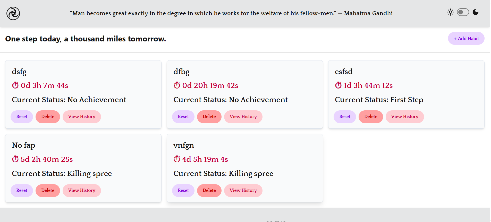
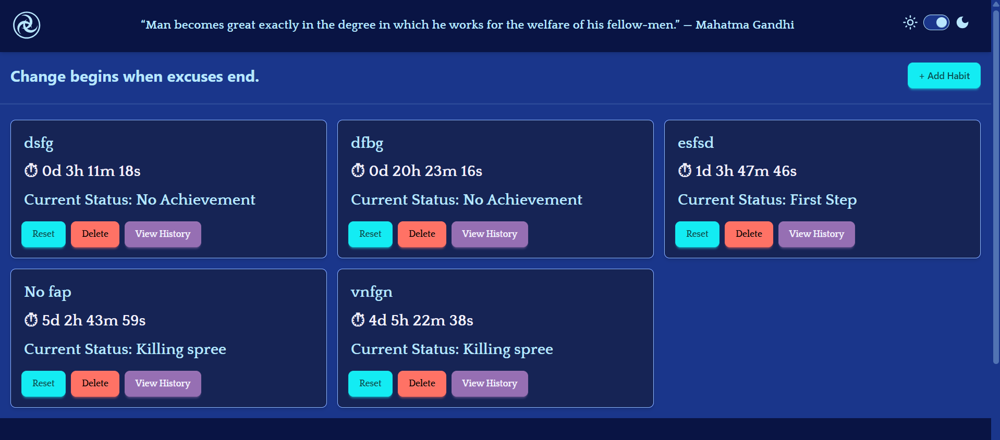
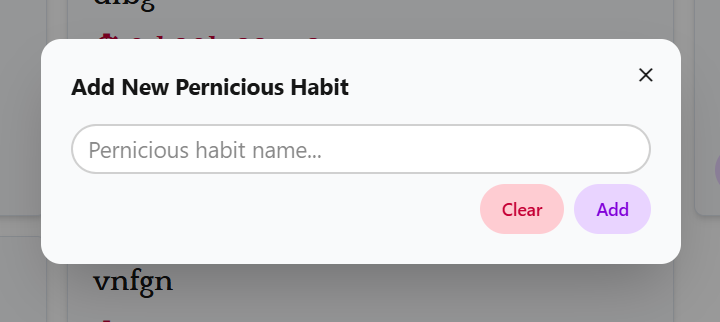
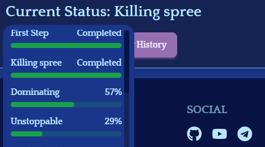

# ⚔️ StreakBlade

A minimalist streak tracker built with React + TypeScript + Tailwind + daisyUI.
Track your abstinence streaks, celebrate milestones, and keep your motivation alive with powerful quotes and progress goals.

## 🚀 Features

- ⏱️ Stopwatch-style streak counter (counts days, hours, minutes, seconds).

- 🌑 Light/Dark mode support.

- 🏆 Achievement milestones (1, 3, 7, 14, 30 days) with progress bars.

- 📜 Motivational quotes loaded daily from a custom JSON.

- 🗂️ History tracking (view past streaks in a dropdown).

- 🎨 Custom scroll + animations for smooth UX.

## 🖼️ Preview

## 🛠️ Tech Stack

- ⚛️ React (with TypeScript)

- 🎨 Tailwind CSS + daisyUI

- 🔄 Custom hooks for streak tracking and history management

## 📦 Installation

### Clone repository

git clone https://github.com/your-username/streakblade.git

### Enter project folder

cd streakblade

### Install dependencies

npm install

### Run development server

npm run dev

## 🎯 Usage

- Start the app.

- Begin your streak by hitting Start.

- Track your achievements as you progress.

- Open the History dropdown to see past streaks.

- Stay motivated with quotes like: “A thousand steps begin with the first.”

## 🤝 Contributing

PRs welcome! If you’d like to add more motivational quotes, achievements, or features — feel free to fork and submit a pull request.

### 📜 License

MIT License © 2025 HailNail
